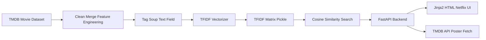

<!-- ===========================
     CineMatch AI - Advanced README
     Repo: gaurav-singh-tech/MOVIE-RECOMMENDATION-SYSTEM---NLP-PROJECT
     =========================== -->

<div align="center">


<p align="center">
  
  
  
  
  
  
</p>

<p>
  <a href="https://cinematch-by-gaurav-singh.onrender.com">
    
  </a>
  <a href="#-how-it-works">
    
  </a>
  <a href="#-how-to-run-locally">
    
  </a>
</p>

<p>
  <b>Architected by:</b> <a href="https://github.com/gaurav-singh-tech">Gaurav Singh</a>
</p>

<p>
  
</p>

</div>

---

## 🎬 CineMatch AI: The “Movie DNA” Engine
> “Streaming services don’t just sell movies; they sell the next movie.”  
CineMatch AI doesn’t guess — it **computes semantic similarity** by converting movie metadata into vectors and comparing them in a high-dimensional space.

✅ **Content-Based Filtering** (works even for new users)  
✅ **TF‑IDF Vectorization + Cosine Similarity**  
✅ **FastAPI backend** + **Netflix‑style UI**  
✅ Posters fetched dynamically via **TMDB API**

---

## 🔗 Live App (original link kept exactly)
👉 https://cinematch-by-gaurav-singh.onrender.com

---

## 🧭 Table of Contents
- [Why this project](#-why-this-project)
- [How it works](#-how-it-works)
- [Architecture](#-architecture-high-level)
- [Tech stack](#-tech-stack)
- [Repo structure](#-repository-structure)
- [Run locally](#-how-to-run-locally)
- [Engineering challenges](#-engineering-challenges--solutions)
- [Business impact](#-real-world-business-impact)
- [Contact](#-contact)

---

## 🎯 Why This Project
Recommendation systems often fail at the start because they rely on historical user interactions. CineMatch AI addresses the classic:

### ✅ Cold Start Problem
Instead of user history, it recommends using **content similarity** (plot, cast, director, keywords, genres).

---

## ⚙️ How It Works
### The “Vector Space” Logic
1. **Data Ingestion**  
   Clean and merge the TMDB dataset (≈ 5,000 movies).

2. **Tag Engineering (“Soup”)**  
   Combine key metadata into a single semantic text field:
   - Genres
   - Keywords
   - Cast
   - Director / Crew
   - Overview

3. **Vectorization (TF‑IDF)**  
   Convert text into numeric vectors.

4. **Similarity Search (Cosine Similarity)**  
   Compare vectors and retrieve closest matches.

5. **Poster Enrichment (TMDB API)**  
   Fetch posters for a premium UI experience.

---

## 🏗️ Architecture (High Level)

> GitHub Mermaid is strict. This diagram avoids characters that commonly break parsing.



---

## 🧰 Tech Stack
<div align="center">


</div>

---

## 📁 Repository Structure
| File | Purpose |
|------|---------|
| `main.py` | FastAPI server + recommendation logic |
| `index.html` | Netflix-inspired UI (Jinja2 template) |
| `df.pkl` | Movie dataframe artifact |
| `indices.pkl` | Title → index mapping for quick lookup |
| `tfidf.pkl` | TF‑IDF vectorizer artifact |
| `tfidf_matrix.pkl` | Vectorized matrix artifact |
| `.env` | TMDB API key config |
| `Procfile` | Render start command |
| `requirements.txt` | Dependencies |
| `README.md` | Documentation |

---

## 🧪 How to Run Locally

### 1) Clone
```bash
git clone https://github.com/gaurav-singh-tech/MOVIE-RECOMMENDATION-SYSTEM---NLP-PROJECT.git
cd MOVIE-RECOMMENDATION-SYSTEM---NLP-PROJECT
```

### 2) Install dependencies
```bash
pip install -r requirements.txt
```

### 3) Configure TMDB API key
Create a `.env` file in the project root:
```bash
TMDB_API_KEY=your_key_here
```

### 4) Run the server
```bash
python main.py
```

### 5) Open in browser
```text
http://127.0.0.1:8000
```

---

## 🚧 Engineering Challenges & Solutions
| Challenge | What Happened | Solution |
|----------|----------------|----------|
| Memory bottleneck | `tfidf_matrix.pkl` is large and can crash low-RAM servers | optimized footprint + careful loading + large file handling |
| Deployment path issues | Windows → Linux broke template/data paths | switched to OS‑agnostic pathing + root-level template usage |
| Cold start latency | Large artifacts slow first response | caching / lightweight endpoints / efficient loading patterns |

---

## 🌍 Real-World Business Impact
| Value | Why it matters |
|------|-----------------|
| Churn reduction | Better recommendations keep users subscribed |
| Long-tail discovery | Promotes lesser-known titles that match user taste |
| Scalability | Works instantly for new users (no user history required) |

---

## 🧠 Mini Mindmap (Quick Recruiter Scan)
```text
CineMatch AI
├── Goal: Recommend similar movies with no user history
├── Method: Content-based filtering
│   ├── Tag Soup from metadata
│   ├── TF-IDF vectorization
│   └── Cosine similarity retrieval
├── Product: Netflix-style UI
│   ├── Search and select base movie
│   ├── Choose number of recommendations
│   └── Poster cards from TMDB API
└── Deployment: Render + Procfile
```

---

## 📈 Optional Dynamic Widgets (Developer Branding)
<div align="center">
  
  
</div>

---

## 🤝 Contact
Replace placeholders:
- **Portfolio:** https://gaurav-singh-tech.github.io/portfolio/#about
- **LinkedIn:**  https://www.linkedin.com/in/contact-gauravsingh/
- **Email:** <gauravbisht2803@gmail.com>  

<div align="center">

### ⭐ If you like this project, consider starring the repo!

</div>
